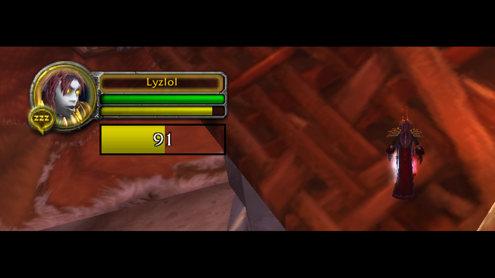

# Gallery Images

Static overview image for the Pulse pages on
[wago.io](https://addons.wago.io/addons/pulse/gallery) and
[CurseForge](https://www.curseforge.com/wow/addons/pulse). It gives visitors a quick
visual summary of Pulse's energy bar straight from the gallery/screenshot strip - the
embedded screenshot and full context live in the project's main `README.md`. Pulse is a
single-feature addon, so one image is enough. This rarely needs updating; this folder is
the source of truth when it does.

**Editing it:** start from a fresh screenshot (any size) and normalize it to a 16:9
canvas under 2 MB. The current image was produced with ffmpeg from
`../pulse_example.png` (`raw/` would be a local scratch folder for source shots - it is
not committed):

```
ffmpeg -i raw/<name>.png \
  -vf "scale=1600:900:force_original_aspect_ratio=decrease:flags=lanczos,pad=1600:900:(ow-iw)/2:(oh-ih)/2:color=black" \
  -frames:v 1 <name>.png
```

Black bars blend into the dark WoW scenes, and 16:9 keeps wide captures from rendering as
thin strips. Sizes stay under **2 MB** to clear CurseForge's 2 MB cap (wago allows up to
3072 KB). Drop the scale to `1440:810` for noisy full-scene shots that creep over 2 MB at
1600×900.

**Titles vs. descriptions:** CurseForge gallery images take both a **title** and a
**description**; wago only takes a description. The heading of the section below is used
as the CurseForge title, and the caption block is the description (and the wago caption).

Upload it by hand in the gallery section of each dashboard.

---

## 1. Energy Bar



```
Pulse visualizes the next energy tick and your current energy - the bar appears the moment you spend energy. Most useful for rogues and their energy regeneration.
```

**File:** `pulse_energy_bar.png`
