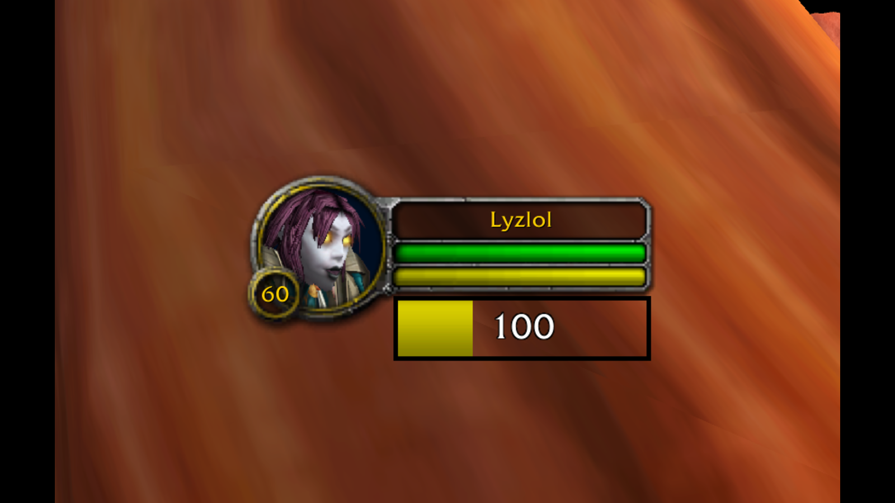
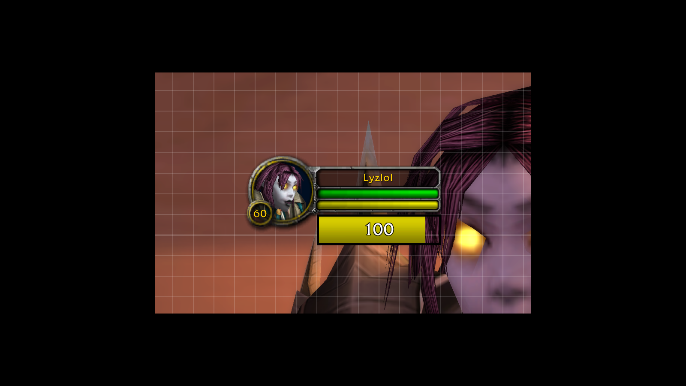
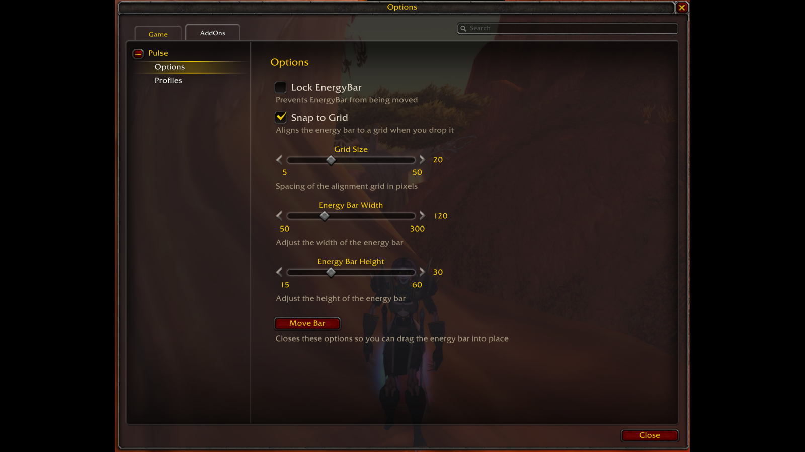
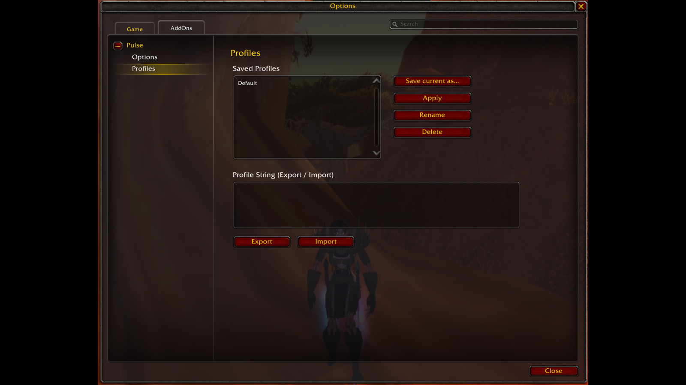

# Gallery Images

Static overview images for the Pulse pages on
[wago.io](https://addons.wago.io/addons/pulse/gallery) and
[CurseForge](https://www.curseforge.com/wow/addons/pulse). They give visitors a quick
visual summary of Pulse's energy bar and configuration straight from the
gallery/screenshot strip - the embedded screenshots and full context live in the
project's main `README.md`. This rarely needs updating; this folder is the source of
truth when it does.

**How these are made:** normally you do not build them by hand - the `wow-media-capture`
skill's `postprocess-shots.ps1` crops each in-game screenshot to the logged frame rect and
writes the 16:9 gallery variant automatically. The rest of this section is the manual
fallback, and documents exactly what that script runs.

Start from a fresh screenshot (any size) and normalize it to a 16:9 canvas under 2 MB:

```
magick <name>.png -resize 1600x900 -background black -gravity center -extent 1600x900 <name>.png
```

Use `magick`, not ffmpeg. The earlier recipe here used
`ffmpeg -vf "scale=...:force_original_aspect_ratio=decrease,pad=..."`, but ffmpeg's docker
wrapper hangs when run synchronously from a non-interactive shell (it blocks on the
inherited null-device stdin even with `-nostdin`), whereas magick over the identical
wrapper completes. Same visual result.

Both tools are containerised, so `cd` into the folder first and pass **relative**
filenames - magick parses a leading `C:` as the raw cyan-channel coder and dies with
`must specify image size`.

Black bars blend into the dark WoW scenes, and 16:9 keeps wide captures from rendering as
thin strips. Sizes stay under **2 MB** to clear CurseForge's 2 MB cap (wago allows up to
3072 KB). Drop the box to `1440x810` for noisy full-scene shots that creep over 2 MB at
1600×900.

**Shrink-only matters.** Plain `-resize` *enlarges* a crop smaller than the box to fill it,
where the old ffmpeg `decrease` recipe only ever shrank. That regressed the in-world tiles
for one round - `pulse_energy_bar.png` and `pulse_grid_snap.png` come from 872×559 crops and
were being blown up ~1.6× to 1404×900 before padding. `postprocess-shots.ps1` now resizes
only when the crop exceeds the box, so those two are padded at native size again (and each
dropped from ~640 KB to ~342 KB).

Doing it by hand, append `>` to the geometry so it never upscales:

```
magick <name>.png -resize "1600x900>" -background black -gravity center -extent 1600x900 <name>.png
```

That works from Git Bash. It does **not** work from PowerShell: `magick` is a `.cmd`
wrapper, so an unquoted `>` reaching cmd.exe is parsed as output redirection and the command
fails with ``no decode delegate for `black'``. That is why the script decides in code rather
than relying on the geometry flag.

**Titles vs. descriptions:** CurseForge gallery images take both a **title** and a
**description**; wago only takes a description. The heading of the section below is used
as the CurseForge title, and the caption block is the description (and the wago caption).

Upload it by hand in the gallery section of each dashboard.

---

## 1. Energy Bar



```
Pulse visualizes the next energy tick and your current energy - the bar appears the moment you spend energy. Most useful for rogues and their energy regeneration.
```

**File:** `pulse_energy_bar.png`

---

## 2. Grid Snap



```
Position the energy bar precisely: with Snap to grid enabled, dragging the unlocked bar lands it on clean grid increments. Set the spacing with the Grid size slider.
```

**File:** `pulse_grid_snap.png`

---

## 3. Options



```
Resize the energy bar to fit your UI with the width and height sliders, then lock it in place once you have positioned it.
```

**File:** `pulse_options.png`

---

## 4. Configuration Profiles



```
Save your Pulse setup as named profiles and switch between them, or share a profile with another character or player using the export/import string.
```

**File:** `pulse_profiles.png`
